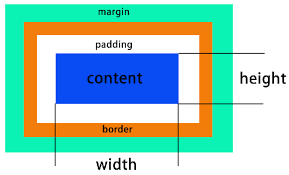
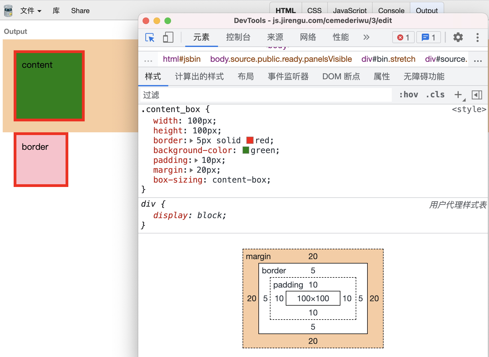
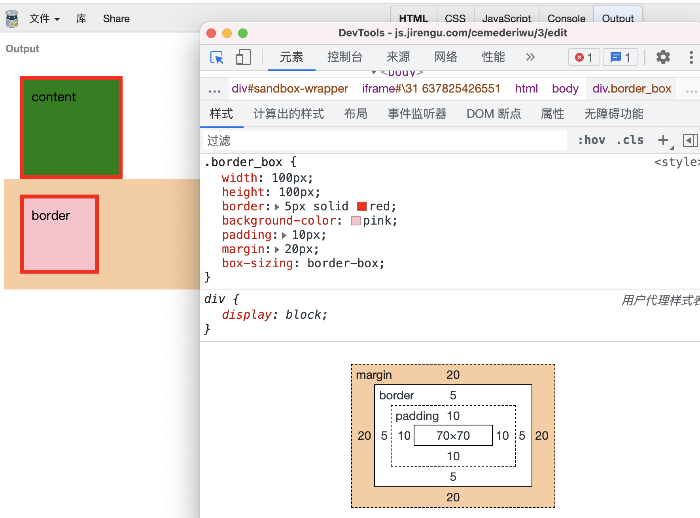
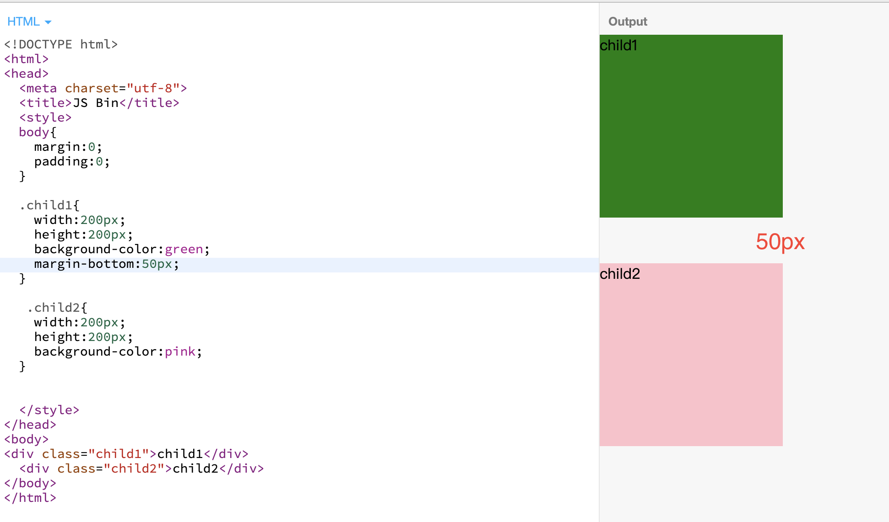
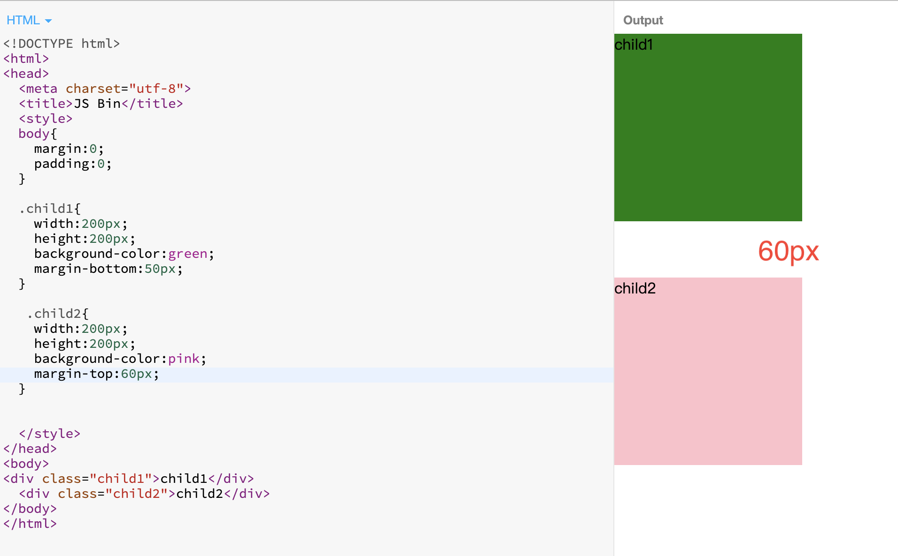
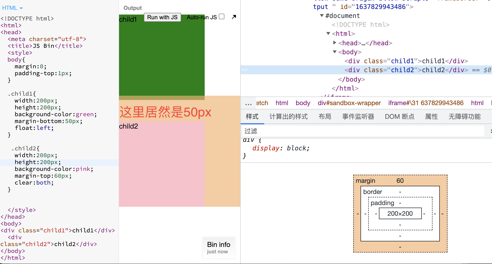
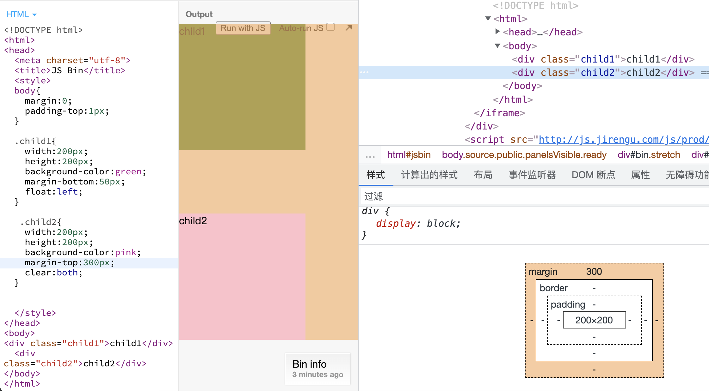

# 盒模型

CSS盒模型是一个用来封装HTML元素的盒子，它包括：边距(margin) ，边框(border)，填充(padding)，和实际内容(content)。

## 两种盒模型：content-box 和 border-box
content-box内容盒：内容就是盒子的边界，content-box width = 内容宽度

border-box边框盒：边框才是盒子的边界，border-box width = 内容宽度 + padding + border

### 示例代码
```html
<!DOCTYPE html>
<head>
  <meta charset="utf-8">
  <title>JS Bin</title>
   <style>
  .content_box{
  width:100px;
  height:100px;
  border:5px solid red;
  background-color:green;
  padding:10px;
  margin:20px;
  box-sizing:content-box;
}

.border_box{
  width:100px;
  height:100px;
  border:5px solid red;
  background-color:pink;
  padding:10px;
  margin:20px;
  box-sizing:border-box;
</style>
</head>
<body>
<div class="content_box">content</div>
<div class="border_box">border</div>
</body>
</html>
```
border-box，设置padding和border时，只影响content的伸缩，盒子本身大小不会变，布局不会变。content-box，保证content大小不变，盒子大小会变，因为css是不交集，所以盒子大小变了，整个css布局都会受到影响。
所以border-box更好用，但是浏览器默认使用的是content-box。

### 内外边距可以用以下属性控制：
- padding-top
- padding-right
- padding-left
- padding-bottom
- padding （顺时针，比如10px,5px,10px,5px。也可以写2个，上下，左右，还可以写1个，四个属性一样。）
- margin-top
- margin-right
- margin-left
- margin-bottom
- margin（（顺时针，比如10px,5px,10px,5px。也可以写2个，上下，左右，还可以写1个，四个属性一样。）

## margin合并
根据 [MDN margin ](https://developer.mozilla.org/zh-CN/docs/Web/CSS/CSS_Box_Model/Mastering_margin_collapsing) 外边距重叠学习，有3种情况：
1. 同一层级相邻元素
2. 块级父元素与第一个或最后一个子元素
3. 空的块级元素
### 同一层级相邻元素
相邻的两个元素之间的外边距重叠，除非后一个元素加上clear-fix清除浮动。

```html
<!DOCTYPE html>
<html>
<head>
  <meta charset="utf-8">
  <title>JS Bin</title>
  <style>
  body{
    margin:0;
    padding:0;
  }
    
  .child1{
    width:200px;
    height:200px;
    background-color:green;
    margin-bottom:50px;
  }
    
   .child2{
    width:200px;
    height:200px;
    background-color:pink;
    margin-top:60px;
  }
    
    
  </style>
</head>
<body>
<div class="child1">child1</div>
  <div class="child2">child2</div>
</body>
</html>
```


上述代码可以看到，child2的div，增加了margin-top;60px;结果，两个div的外边距只增加了10px;
我还使用了50px；没有变化，还是间距50px;如果换成40px，间距还是50px;
总结：同一层级相邻元素，相邻的两个兄弟元素之间的外边距会取两者之前的最大值进行合并。

### 浮动
```css
  body{
    margin:0;
    padding-top:1px;
  }
    
  .child1{
    width:200px;
    height:200px;
    background-color:green;
    margin-bottom:50px;
    float:left;
  }
    
   .child2{
    width:200px;
    height:200px;
    background-color:pink;
    margin-top:60px;
    clear:both;
  }
```


child1的div增加左浮动，脱离了文档流，child2的div和它就不再是兄弟了。但是它是块级元素，不能和inline-box在一行，得在child1下面。
这个时候，child2距离最顶部，也就是body的top距离远大于60px所以距离是50px。
修改child2的margin-top:300px。这个时候距离body的top距离，200+50<300。所以margin距离顶部为300px，距离child1为100px，如下图。
```css
.child2{
    margin-top: 300px;
}
```



> 下面这两个知识点，有些还没学了，看着MDN理解了2遍。以后再学。直接黏贴过来mdn。

### 块级父元素与第一个或最后一个子元素
如果没有边框border，内边距padding，行内内容，也没有创建块级格式上下文或清除浮动来分开一个块级元素的上边界margin-top 与其内一个或多个后代块级元素的上边界margin-top；或没有边框，内边距，行内内容，高度height，最小高度min-height或 最大高度max-height 来分开一个块级元素的下边界margin-bottom与其内的一个或多个后代后代块元素的下边界margin-bottom，则就会出现父块元素和其内后代块元素外边界重叠，重叠部分最终会溢出到父级块元素外面。
```html
<style type="text/css">
    section    {
        margin-top: 13px;
        margin-bottom: 87px;
    }

    header {
        margin-top: 87px;
    }

    footer {
        margin-bottom: 13px;
    }
</style>

<section>
    <header>上边界重叠 87</header>
    <main></main>
    <footer>下边界重叠 87 不能再高了</footer>
</section>
```


### 空的块级元素
当一个块元素上边界margin-top 直接贴到元素下边界margin-bottom时也会发生边界折叠。这种情况会发生在一个块元素完全没有设定边框border、内边距padding、高度height、最小高度min-height 、最大高度max-height 、内容设定为inline或是加上clear-fix的时候。
一些需要注意的地方：
```html
<style>
    p {
        margin: 0;
    }
    div {
        margin-top: 13px;
        margin-bottom: 87px;
    }
</style>

<p>上边界范围是 87 ...</p>
<div></div>
<p>... 上边界范围是 87</p>
```
上述情况的组合会产生更复杂的外边距折叠。
即使某一外边距为0，这些规则仍然适用。因此就算父元素的外边距是0，第一个或最后一个子元素的外边距仍然会“溢出”到父元素的外面。
如果参与折叠的外边距中包含负值，折叠后的外边距的值为最大的正边距与最小的负边距（即绝对值最大的负边距）的和,；也就是说如果有-13px 8px 100px叠在一起，边界范围的技术就是 100px -13px的87px。
如果所有参与折叠的外边距都为负，折叠后的外边距的值为最小的负边距的值。这一规则适用于相邻元素和嵌套元素。
以上这些内容都是发生在Block-Level的元素，设定floating和absolutely positioned的元素完全不用担心边界重叠的问题。